# :mobile_phone_off: Chat-P2P

基于java的socket实现的P2P在线交流平台，实现了在线实时交流和文件传输功能

JDK版本：1.8    页面编写：javafx

页面辅助工具：Screen Builder

## :star:How to start

使用编辑器打开，在Main.java文件处运行

如果想在同一主机运行，请将代码文件分别克隆至两个文件夹，修改其中一个项目文件中的Server/Config.java下的serverPort服务端口号，避免端口冲突，再分别运行两个项目文件，即可在一台主机上展示P2P交流。

## :computer:Perform

### 1. **登录界面**

用户1                                          用户2

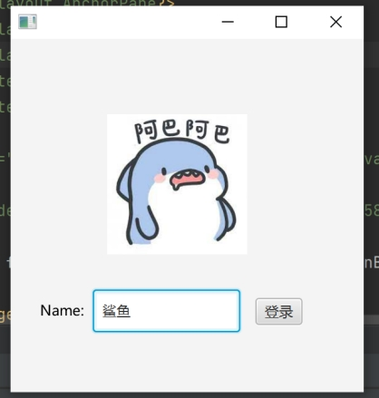

### 2. **登录完成后**

用户1

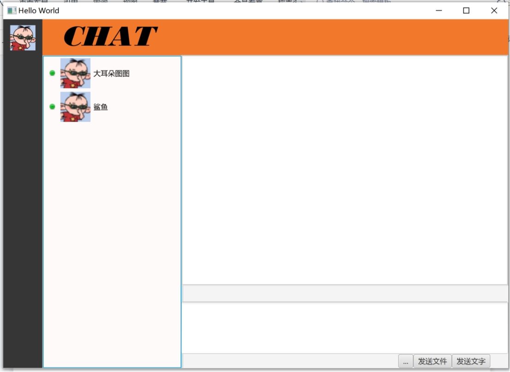 

用户2

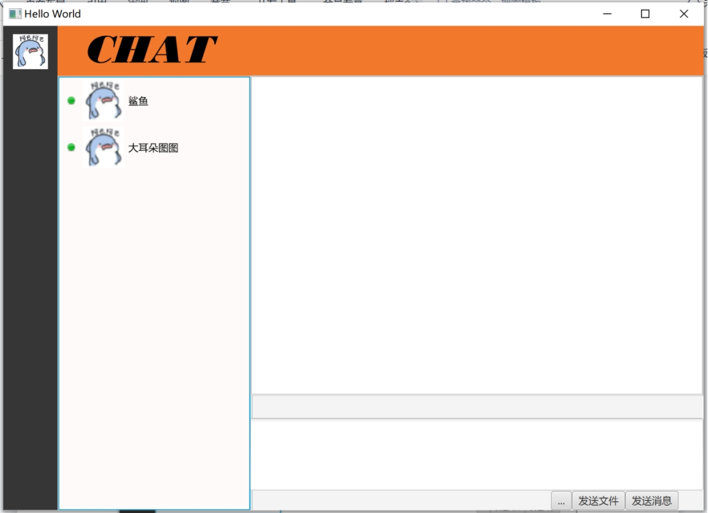 

### 3. **消息发送**

用户【鲨鱼】向用户【大耳朵图图】发送消息

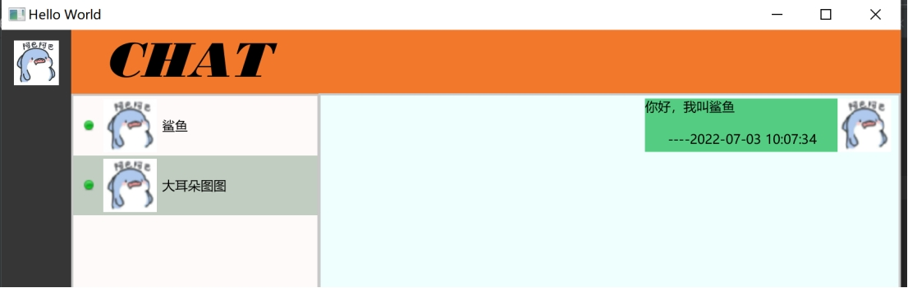 

用户【大耳朵图图】此时会收到新消息提醒

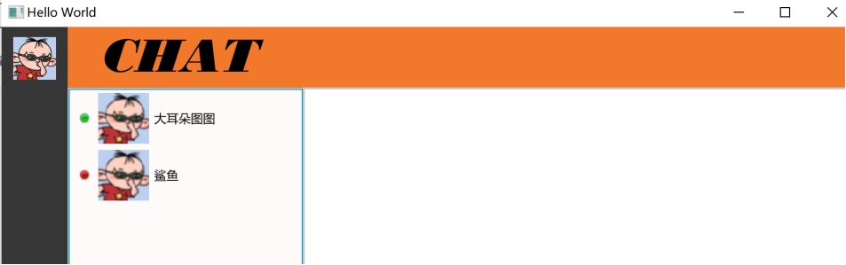 

两用户进行持续通信如下图

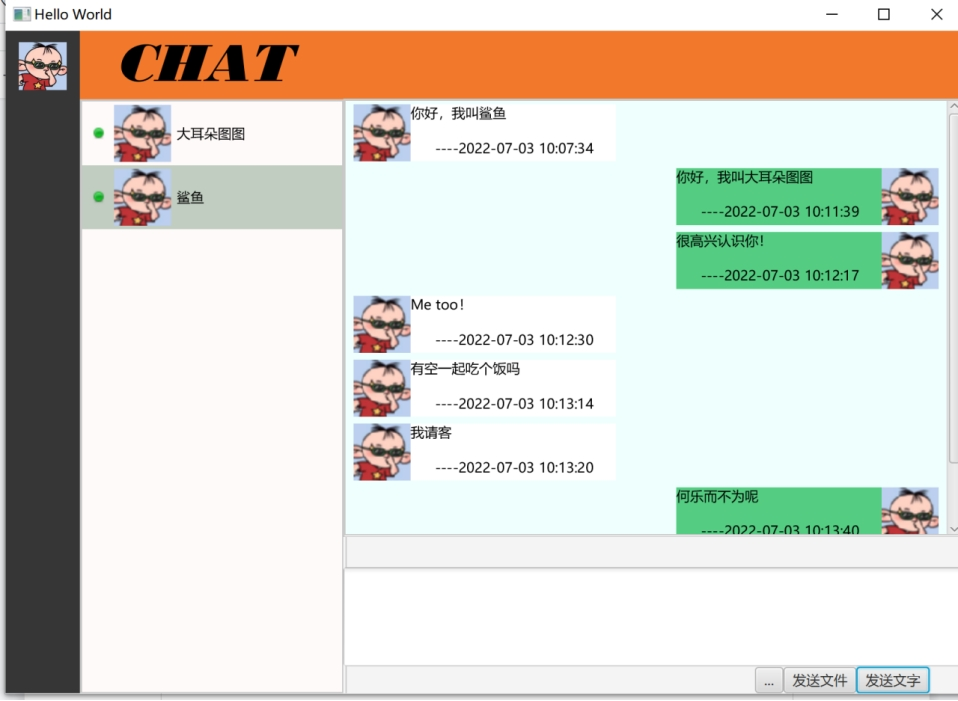 

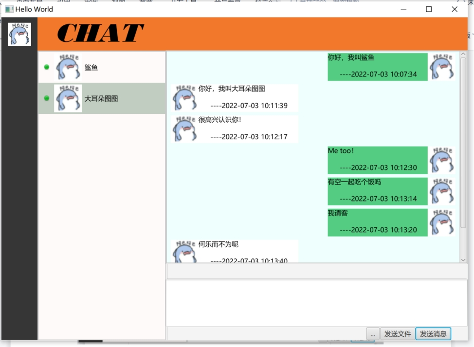 

### 4. **文件发送**

（1）选择文件 

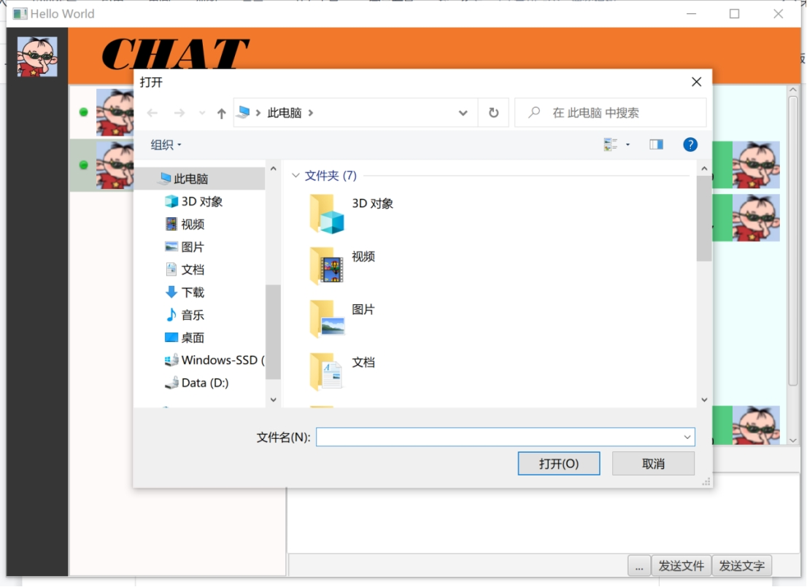 

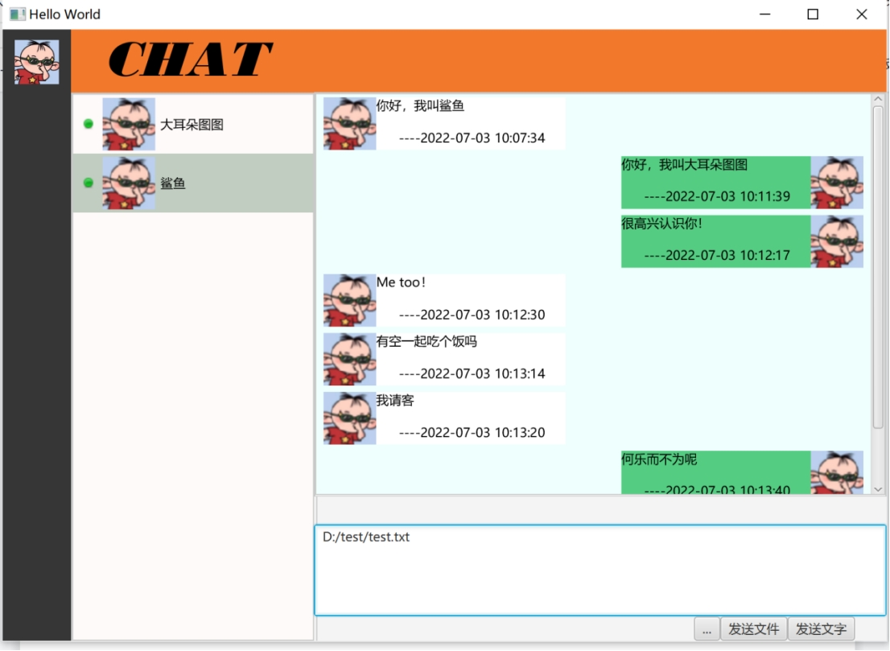 

（2）发送文件

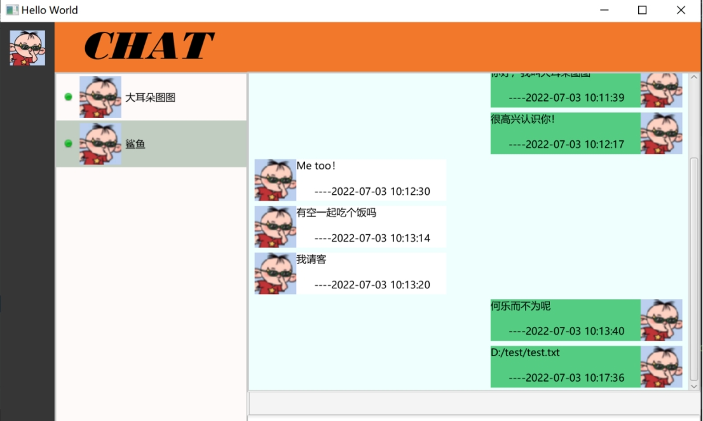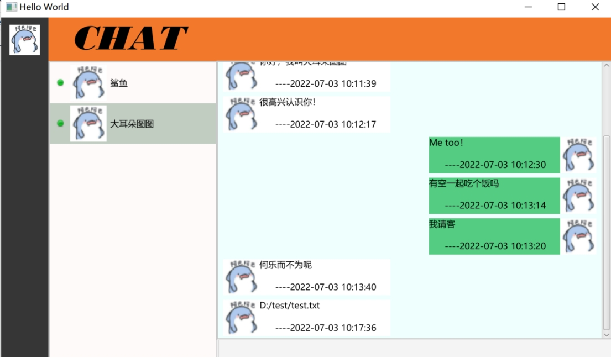

## :art:流程图

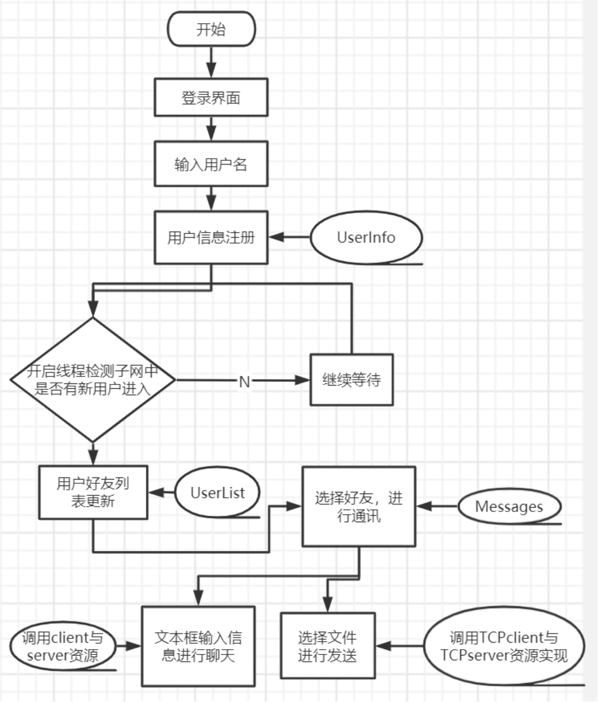

